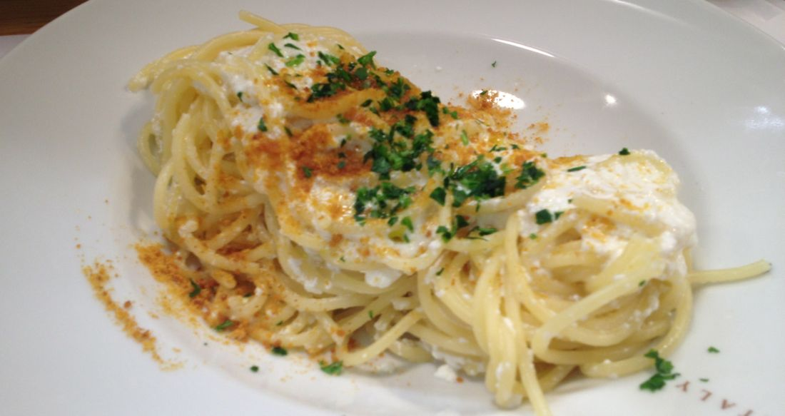
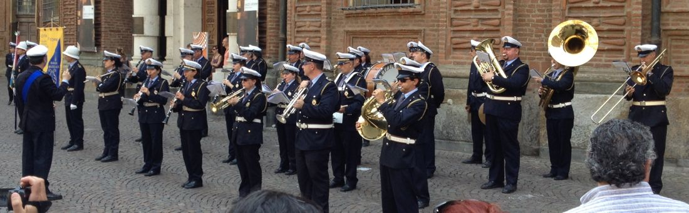

I have just returned from teaching "big data analysis with MapReduce" at Big Dive in Turin, Italy. Big Dive is a technology training program about data science (statistics), visualization (displaying data in an understandable way), and programming. Most of the students are in some type of grad school. The tools they learn at Big Dive are helpful for processing and presenting data for scientific purposes.

I was there to teach [mrjob](http://mrjob.readthedocs.org/), a programming tool that makes it easy to run code on lots of computers at once so analyses can be run in minutes or hours rather than days. I contributed to the mrjob project significantly when I worked for Yelp, so I was contacted a few weeks ago about teaching.

After the nail-biting process of getting my passport on short notice and buying some very expensive plane tickets, I flew across the world and groggily landed in Turin.

One of my hosts, Alessandro Molina, drove me to my hotel. He works at [Axant](http://www.axant.it/), a company that helps put on Big Dive. After I had slept a couple of hours in the hotel, he took me on a long walk to the city center to show me how to get to the event building, and to go to dinner. Afterward I returned to my hotel a bit overwhelmed.

# Monday

I woke up "early," in time to order breakfast at a restaurant where none of the staff spoke English. Pointing, gesturing, and pronunciation mangling was involved. My stomach full, I walked to Big Dive early to get acquainted with the people and the building, and to finish my notes and slides for the day.

No lesson plan survives contact with students. Having written much of the software they were learning, I was used to just knowing things and don't have much of a beginner's mind about it anymore. Additionally, their skill sets ranged from almost no programming knowledge to proficient physics PhD.

Two hours of seat-of-the-pants-flying later, most students seemed to understand what I wanted them to understand. For dinner, Alessandro took me to Eataly, a well-known collection of restaurants with authentic dishes from across Italy. I had this:

# Tuesday

# Friday

The previous night, I had been introduced to Seth. He's a friend of one of the students and was visiting her. She was in an event all day, so Seth and I decided to be tourists together so we would both have someone to talk to.

We met at 11 to see the royal palace. (Pictures, rooms.) (Armory.) (Archaeological Museum.)

Lunch at baked potato place.

Coffee with cream.

Walked to the top of a near by hill/church. (Name?)

Walked the length of the park. It reminded me of Golden Gate Park in its length (about half).

Then we parted ways and I went back to my hotel to relax. At 9, I went on a gourmet tram dinner around the town with a set of staff and diners that only spoke Italian. Went to bed so I could get up early for my flight.